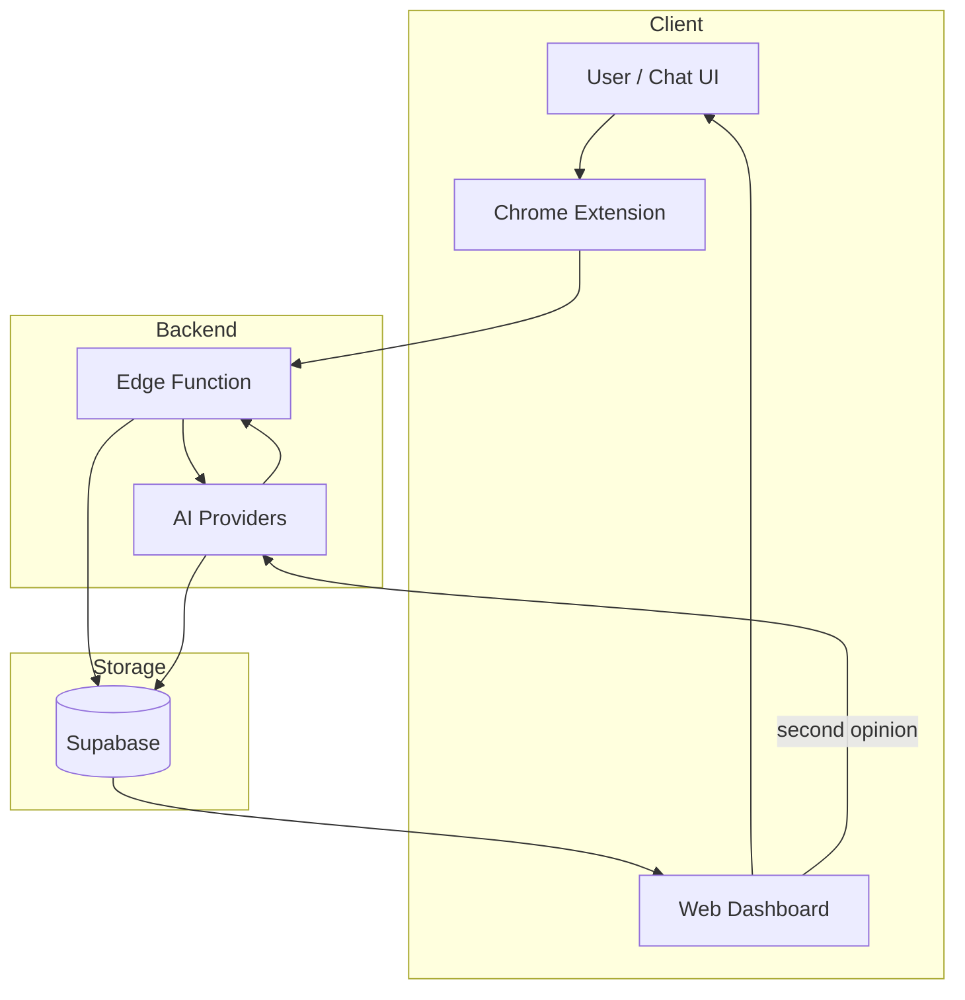
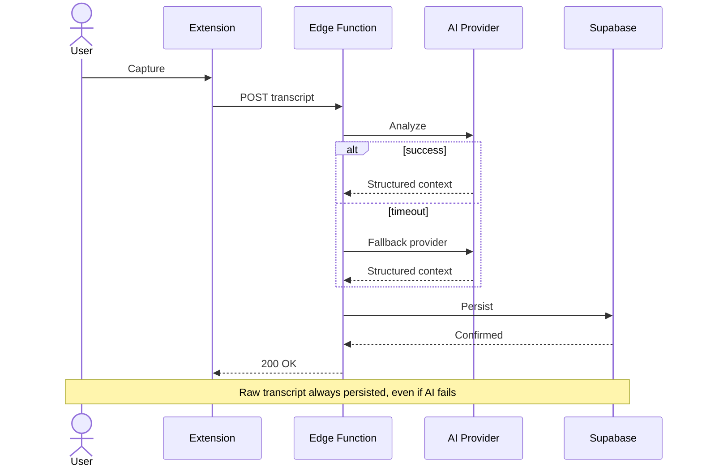
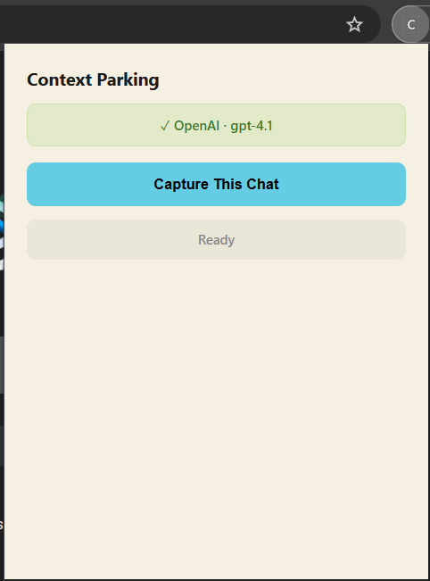
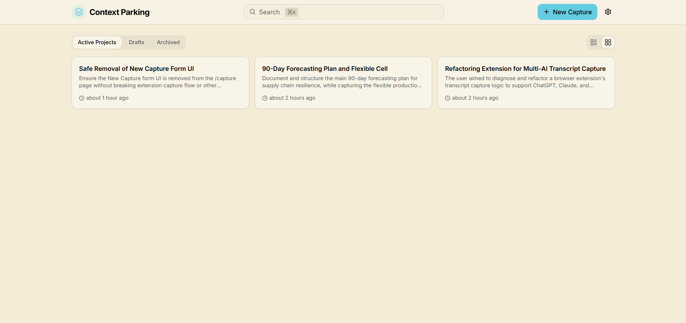
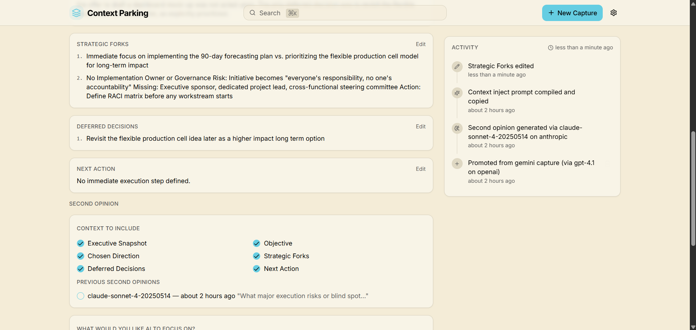
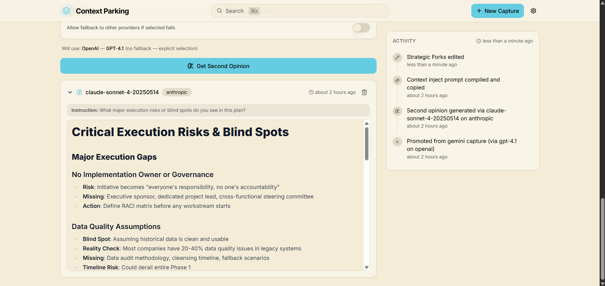
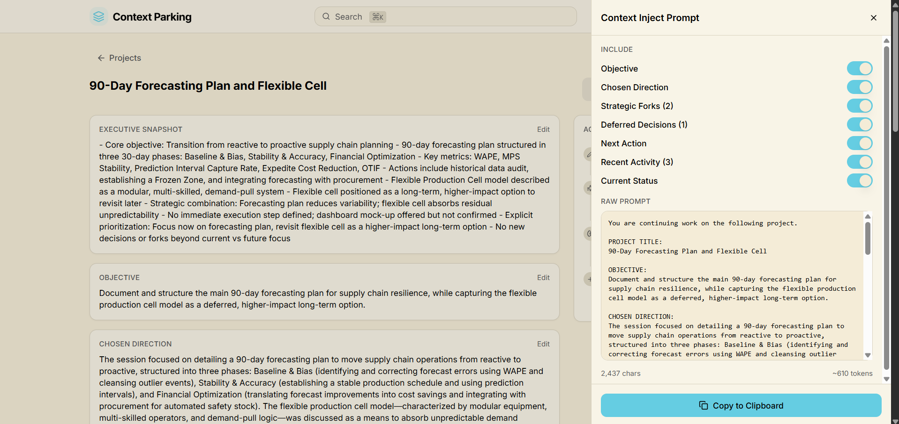

# Context Parking

Context Parking prevents the loss of unfinished AI work by capturing chat sessions, extracting structured context, and enabling deterministic resume without re-prompting.

## How It Works

A user is mid-conversation in ChatGPT or Claude. They've made decisions, explored trade-offs, and identified next steps — but the chat is ephemeral. Closing the tab means losing that context.

Context Parking solves this in five steps:

1. **Capture.** The user clicks the Chrome extension on any ChatGPT or Claude conversation. The extension extracts the full transcript from the DOM.
2. **Transmit.** The extension sends the raw transcript to a Supabase Edge Function, authenticated via a shared key.
3. **Analyze.** The Edge Function routes the transcript to an AI provider (OpenAI, Anthropic, or Google) with a structured prompt. The AI extracts: summary, objective, strategic alternatives, deferred decisions, chosen direction, and next action.
4. **Persist.** The structured output is stored in Supabase PostgreSQL alongside the raw transcript. Nothing is lost.
5. **Resume.** The user opens the web dashboard, reviews captured context, and promotes it to a tracked project or draft. They can request a second opinion from a different AI provider to validate decisions.

The result: AI work is no longer disposable. Every session produces a durable artifact.

## Chrome Extension

The Chrome extension is the primary capture interface — not a secondary tool. All context enters the system through it.

1. Open `chrome://extensions/` and enable **Developer mode**
2. Click **Load unpacked** and select `browser-extension/`
3. Click the extension icon and configure:
   - **Edge Function URL** — `https://your-project.supabase.co/functions/v1/capture-extension`
   - **Shared Key** — generate with `openssl rand -hex 32`, then add as `EXTENSION_SHARED_KEY` in Supabase Edge Function Secrets
4. Navigate to any ChatGPT or Claude conversation and click **Capture This Chat**

## Architecture



No authentication layer. No user accounts. A single shared secret protects writes. The web dashboard reads via the Supabase anon key.

### Runtime Sequence (simplified)



Full sequence diagram with retry paths and second opinion flow: [docs/runtime-flow.md](docs/runtime-flow.md)

## Screenshots

### 1. Capture from Any AI Chat



Instantly extract the full transcript from any ChatGPT or Claude conversation using the Chrome extension.

### 2. Structured Project Dashboard



Review all captured context and organize sessions by promoting them to specific, tracked projects.

### 3. Project Detail View



View structured context blocks automatically extracted from raw transcripts, including strategic alternatives and deferred decisions.

### 4. Multi-Model Second Opinion Layer



Request a second opinion from distinct AI providers to cross-validate decisions and identify missing nuance.

### 5. Compile Context Inject Prompt



Generate a deterministic resume prompt, combining all project context to seamlessly continue work in a new AI session.

## Design and Operational Docs

| Document | Content |
|----------|---------|
| [System Design](docs/system-design.md) | System overview, data lifecycle, architecture rationale |
| [Infrastructure Decisions](docs/infrastructure-decisions.md) | Why Supabase, why Edge Functions, why extension, alternatives considered |
| [Failure Modes](docs/failure-modes.md) | 7 failure scenarios with data loss analysis and mitigation |
| [Product Metrics](docs/product-metrics.md) | Activation, retention, success, and failure metrics |
| [Manual Capture Decision](docs/decisions/manual-capture.md) | Why capture is manual — UX, privacy, determinism |
| [Security](SECURITY.md) | Data storage, API key handling, transcript privacy |

## Reliability and Failure Handling

**Multi-provider AI routing.** The system supports OpenAI, Anthropic, and Google as AI backends. If the primary provider fails, the Edge Function falls back to the next available provider with a compatible model. The second opinion feature uses the same fallback chain independently.

**Retry and graceful degradation.** Provider timeouts and rate limits are caught at the Edge Function level. If all providers fail, the raw transcript is still persisted — the capture is not lost. AI processing can be retried later.

**Persistence guarantees.** Every capture writes to Supabase PostgreSQL before returning a response. The raw transcript is always stored regardless of AI processing outcome. Local project and draft state uses browser localStorage with Zustand, persisted across sessions.

**Deterministic context reconstruction.** Captured context is structured into discrete fields (summary, objective, alternatives, deferred decisions, chosen direction, next action). This makes resume deterministic — the user does not need to re-read an entire transcript to understand where they left off.

## Product Design Decisions

**Manual capture instead of automatic memory.** Automatic recording of every AI conversation creates noise. Most chat sessions are exploratory — throwaway questions, debugging, casual lookup. The user knows which sessions contain real decisions. Manual capture respects that signal-to-noise judgment and keeps the system useful rather than exhaustive.

**Explicit resume over passive history.** The dashboard is not a chat log viewer. Captured context is promoted into projects or drafts with a deliberate action. This forces the user to decide what is worth tracking, which produces a clean, actionable workspace instead of an ever-growing backlog.

**Supabase over local-only storage.** Local-only storage fails across devices and disappears when browsers are reset. Supabase provides durable, queryable storage accessible from any machine. The anon key model means no authentication overhead while still supporting structured queries and future multi-device access.

**Browser extension over embedded UI.** AI chat interfaces (ChatGPT, Claude) are closed platforms. There is no API to pull conversation history programmatically. A browser extension can read the DOM directly, which is the only reliable way to extract full transcripts without requiring the user to copy-paste. The extension also captures metadata (source, title, URL) automatically.

**Edge Function over client-side AI calls.** Running AI summarization in a Supabase Edge Function keeps API keys server-side and moves compute off the user's browser. It also enables consistent prompt engineering across all captures regardless of the client.

**Second opinion as a first-class feature.** AI summaries are probabilistic. A single model may miss nuance, hallucinate priorities, or frame decisions differently than the user intended. The second opinion feature lets users cross-validate captured context against a different model, increasing confidence in the extracted structure.

## Quickstart

```sh
git clone https://github.com/YOUR_USERNAME/context-keeper.git
cd context-keeper
cp .env.example .env
npm install
npx supabase functions deploy capture-and-summarize
npm run dev
```

The setup wizard will prompt for AI provider configuration on first launch.

## Environment Variables

| Variable | Description |
|----------|-------------|
| `VITE_SUPABASE_URL` | Supabase project URL |
| `VITE_SUPABASE_PUBLISHABLE_KEY` | Supabase anon/public key |

AI provider keys are configured through the setup wizard and stored in browser localStorage.

## Tech Stack

| Layer | Technology |
|-------|------------|
| Frontend | React 18, Vite, TypeScript |
| Styling | Tailwind CSS, shadcn/ui |
| State | Zustand (local), Supabase (captures) |
| AI | OpenAI, Anthropic, Google via Edge Function |
| Backend | Supabase Edge Functions (Deno) |
| Database | Supabase PostgreSQL |
| Extension | Chrome Manifest V3 |

## Project Structure

```
context-keeper/
├── src/
│   ├── components/
│   ├── pages/
│   ├── store/
│   ├── lib/
│   └── integrations/
├── browser-extension/
├── supabase/
│   ├── functions/
│   └── migrations/
├── docs/
└── public/
```

## Scripts

| Command | Description |
|---------|-------------|
| `npm run dev` | Start dev server |
| `npm run build` | Production build |
| `npm run lint` | Run ESLint |
| `npm run test` | Run tests |
| `npm run preview` | Preview production build |

## License

MIT
