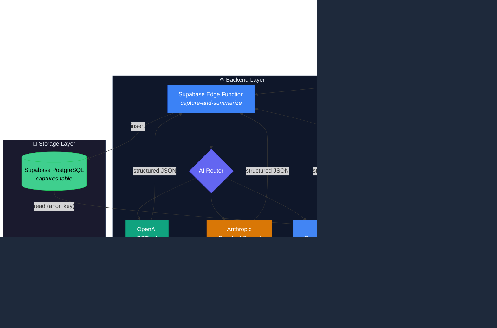

<div align="center">

# 🅿️ Context Parking

**AI conversations are full of decisions, trade-offs, and next steps — but they vanish when you close the tab.**

Context Parking captures your ChatGPT and Claude sessions, uses AI to extract what matters,<br>and gives you a dashboard to track projects, park drafts, and never lose context again.

[](https://react.dev)
[](https://supabase.com)
[](https://typescriptlang.org)
[](LICENSE)

</div>

---

## ⚡ 2-Minute Demo

```
1. npm install && npm run dev        → Dashboard opens at localhost:8080
2. Load browser-extension/ in Chrome → Extension ready
3. Open a ChatGPT or Claude chat     → Click "Capture This Chat"
4. Return to dashboard               → Project appears with AI summary
```

---

## 🏗️ Architecture



---

## 📸 Screenshots

<!-- Replace with actual screenshots -->
> _Coming soon — run locally and explore the dashboard._

| Dashboard | Capture Flow | Draft Editor |
|-----------|--------------|--------------|
| _screenshot_ | _screenshot_ | _screenshot_ |

---

## 🚀 Quickstart

### Prerequisites

- Node.js 18+
- A [Supabase](https://supabase.com) project (free tier works)
- An API key for at least one AI provider (OpenAI, Anthropic, or Google)

### 1. Clone & Install

```sh
git clone https://github.com/YOUR_USERNAME/context-keeper.git
cd context-keeper
npm install
```

### 2. Configure Environment

```sh
cp .env.example .env
```

Edit `.env` with your Supabase credentials:

```env
VITE_SUPABASE_URL=https://your-project.supabase.co
VITE_SUPABASE_PUBLISHABLE_KEY=your-anon-key
```

> Find these in [Supabase Dashboard → Settings → API](https://supabase.com/dashboard)

### 3. Deploy Edge Function

```sh
npx supabase functions deploy capture-and-summarize
```

### 4. Start the App

```sh
npm run dev
```

Open [http://localhost:8080](http://localhost:8080) — the **Setup Wizard** will guide you through AI provider configuration on first launch.

---

## 🧩 Browser Extension

1. Open `chrome://extensions/`
2. Enable **Developer mode** (top right)
3. Click **Load unpacked** → select `browser-extension/`
4. Click the extension icon and configure:
   - **Edge Function URL** — `https://your-project.supabase.co/functions/v1/capture-extension`
   - **Shared Key** — generate one:
     ```sh
     openssl rand -hex 32
     ```
     Then add it as `EXTENSION_SHARED_KEY` in [Supabase Edge Function Secrets](https://supabase.com/dashboard)
5. Navigate to ChatGPT or Claude → open a conversation → **Capture This Chat**

---

## 🔐 Environment Variables

| Variable | Description | Where to Find |
|----------|-------------|---------------|
| `VITE_SUPABASE_URL` | Supabase project URL | Dashboard → Settings → API |
| `VITE_SUPABASE_PUBLISHABLE_KEY` | Supabase anon/public key | Dashboard → Settings → API |

AI provider keys (OpenAI, Anthropic, Google) are configured through the **Setup Wizard** in the web app and stored in browser `localStorage` — never committed to code.

---

## 🛠️ Tech Stack

| Layer | Technology |
|-------|-----------|
| Frontend | React 18 · Vite · TypeScript |
| Styling | Tailwind CSS · shadcn/ui |
| State | Zustand (local) · Supabase (captures) |
| AI | OpenAI · Anthropic · Google (via Edge Function) |
| Backend | Supabase Edge Functions (Deno) |
| Database | Supabase PostgreSQL |
| Extension | Chrome Manifest V3 |

---

## 📁 Project Structure

```
context-keeper/
├── src/                    # React web application
│   ├── components/         # UI components
│   ├── pages/              # Route pages
│   ├── store/              # Zustand state
│   ├── lib/                # Utilities and API
│   └── integrations/       # Supabase client
├── browser-extension/      # Chrome extension (MV3)
├── supabase/
│   ├── functions/          # Edge functions
│   └── migrations/         # Database migrations
└── public/                 # Static assets
```

---

## 📋 Scripts

| Command | Description |
|---------|-------------|
| `npm run dev` | Start dev server |
| `npm run build` | Production build |
| `npm run lint` | Lint with ESLint |
| `npm run test` | Run tests |
| `npm run preview` | Preview production build |

---

## 📄 License

MIT
