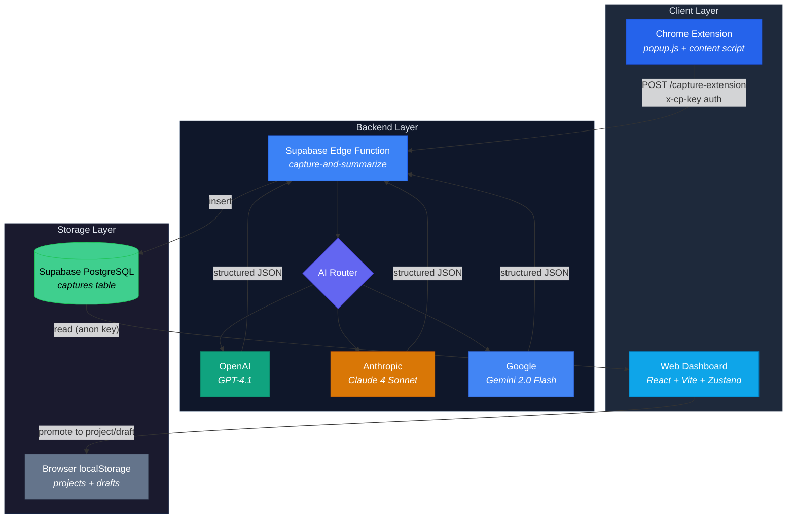

# Context Parking

A tool for capturing AI chat sessions and extracting actionable context. Context Parking watches your ChatGPT and Claude conversations, runs them through AI summarization, and stores structured project context — decisions, trade-offs, next steps — in a persistent dashboard.

## Demo

```
1. npm install && npm run dev       → Dashboard at localhost:8080
2. Load browser-extension/ in Chrome
3. Open a ChatGPT or Claude conversation
4. Click the extension → "Capture This Chat"
5. Return to dashboard → AI-summarized project appears
```

## Architecture

The browser extension captures chat transcripts and sends them to a Supabase Edge Function, which routes to an AI provider for structured summarization before storing results in PostgreSQL.



## Quickstart

```sh
git clone https://github.com/YOUR_USERNAME/context-keeper.git
cd context-keeper
cp .env.example .env    # fill in Supabase credentials
npm install
npx supabase functions deploy capture-and-summarize
npm run dev
```

The setup wizard will prompt for AI provider configuration on first launch.

## Browser Extension

1. Open `chrome://extensions/` and enable **Developer mode**
2. Click **Load unpacked** → select `browser-extension/`
3. Click the extension icon and enter:
   - **Edge Function URL** — `https://your-project.supabase.co/functions/v1/capture-extension`
   - **Shared Key** — generate with `openssl rand -hex 32`, then add as `EXTENSION_SHARED_KEY` in Supabase Edge Function Secrets

## Environment Variables

| Variable | Description |
|----------|-------------|
| `VITE_SUPABASE_URL` | Supabase project URL |
| `VITE_SUPABASE_PUBLISHABLE_KEY` | Supabase anon/public key |

AI provider keys are configured through the setup wizard and stored in browser `localStorage`.

## Tech Stack

| Layer | Technology |
|-------|------------|
| Frontend | React 18, Vite, TypeScript |
| Styling | Tailwind CSS, shadcn/ui |
| State | Zustand (local), Supabase (captures) |
| AI | OpenAI, Anthropic, Google via Edge Function |
| Backend | Supabase Edge Functions (Deno) |
| Database | Supabase PostgreSQL |
| Extension | Chrome Manifest V3 |

## Project Structure

```
context-keeper/
├── src/                    # React web application
│   ├── components/         # UI components
│   ├── pages/              # Route pages
│   ├── store/              # Zustand state
│   ├── lib/                # Utilities and API
│   └── integrations/       # Supabase client
├── browser-extension/      # Chrome extension (MV3)
├── supabase/
│   ├── functions/          # Edge functions
│   └── migrations/         # Database migrations
└── public/                 # Static assets
```

## Scripts

| Command | Description |
|---------|-------------|
| `npm run dev` | Start dev server |
| `npm run build` | Production build |
| `npm run lint` | Run ESLint |
| `npm run test` | Run tests |
| `npm run preview` | Preview production build |

## License

MIT
