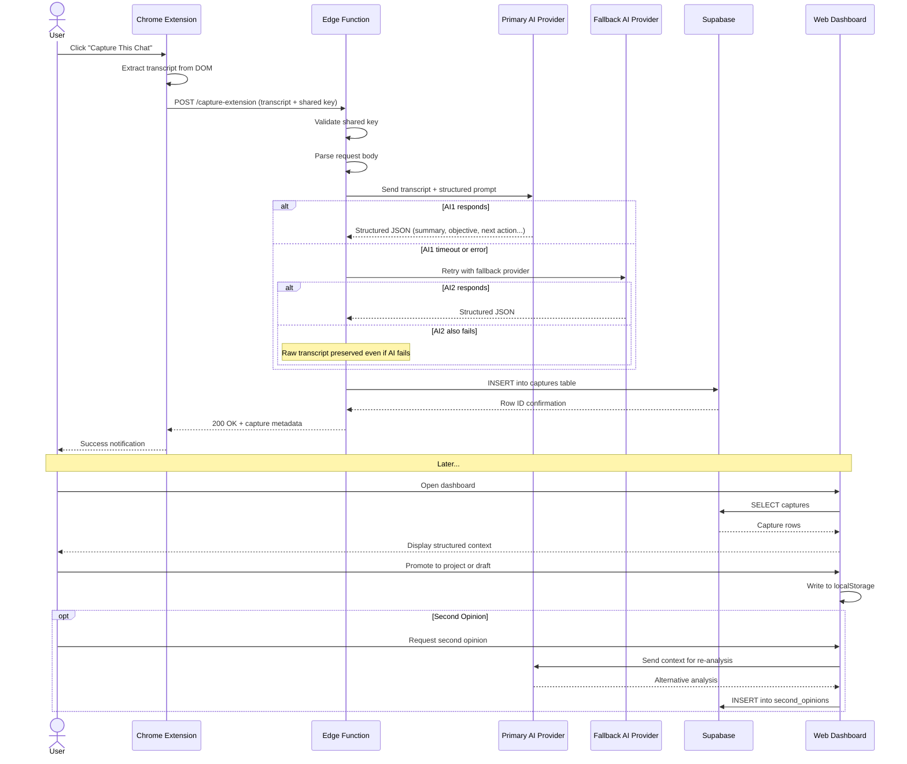

# Runtime Flow

## Capture Sequence

The following diagram shows the complete runtime flow from user action through AI processing to context resume, including failure paths.

## Key Behaviors

**Timeout handling.** AI provider calls have implicit timeouts at the Edge Function level. If the primary provider does not respond, the system moves to the next available provider in the fallback chain.

**Retry path.** The fallback order is determined by available API keys: OpenAI → Anthropic → Google. Each provider is attempted once. If all fail, the raw transcript is still written to the database — no data is lost.

**Persistence confirmation.** The Edge Function does not return 200 to the extension until the database write completes. If the database write fails, the extension receives an error and the user is notified.

**Data durability.** The raw transcript is always persisted regardless of AI processing outcome. Structured fields may be empty if AI extraction fails, but the source material is never lost.
